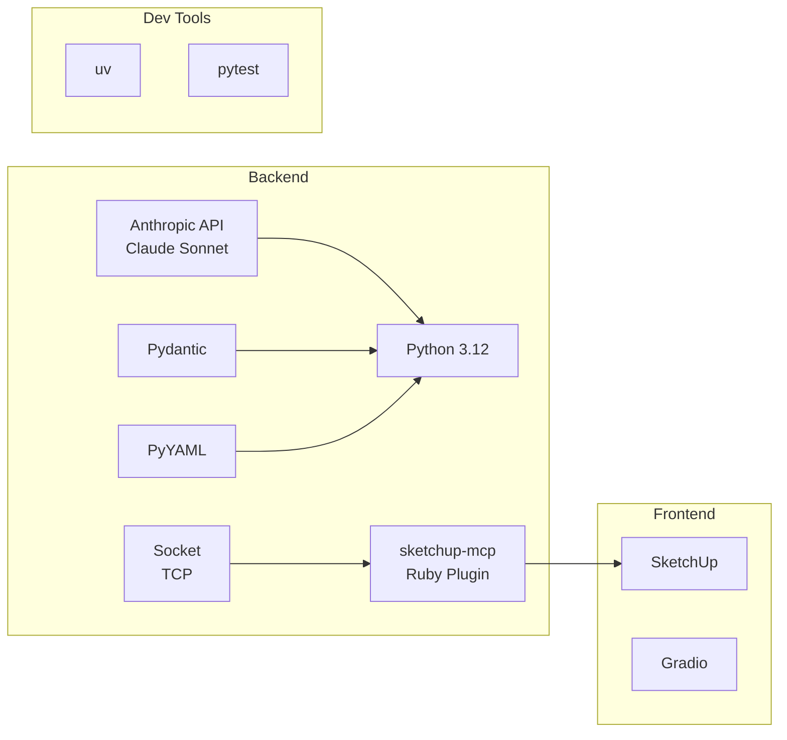

# ATELIER.AI
Architect's AI agents for workflow recording and tool making.

### What is it
Atelier is a multi-agent AI system designed to automate architectural workflows and enable high-productivity solo practice. It operates as a virtual team of specialized AI agents, each handling a distinct role in the building design and permit workflow — from zoning research to drawing set submission.

The system is built around a central GatewayLLM that decomposes incoming requests and dispatches them to software-specific sub-agents (e.g. SketchUp, Rhino). Each agent runs its own agentic loop, executes commands through a software bridge, self-evaluates the result, and retries if needed. A recorder module captures every state change, enabling the system to learn from successful workflows and persist them as reusable tools.

### Tech Stack


### File Structure
```
atelier/
│
├── contracts/                   # Interface definitions between modules
│   ├── __init__.py
│   ├── requests.py              # Request / response data structures
│   ├── recording.py             # S0 + Delta schema (shared by recorder and agents)
│   ├── bridge.py                # Bridge command / return structures (shared by agents and bridge)
│   └── tools.py                 # Tool definition structures
│
├── gateway/                     # GatewayLLM
│   ├── __init__.py
│   ├── gateway.py               # Core logic: decompose requests, dispatch, manage workflow
│   └── prompts/
│       └── gateway.yaml
│
├── agents/                      # Software-specific sub-LLMs
│   └── sketchup/
│       ├── __init__.py
│       ├── agent.py             # SketchupLLM core logic + FSM
│       ├── fsm.py               # Finite state machine
│       └── prompts/
│           ├── modeling.yaml
│           ├── material.yaml
│           └── check.yaml
│
├── recorder/                    # General-purpose recording module
│   ├── __init__.py
│   ├── recorder.py              # Core logic: manage S0, linear_flow, undo_log
│   └── adapters/
│       ├── __init__.py
│       └── sketchup/
│           ├── __init__.py
│           └── observer.rb      # Ruby Observer (SketchUpAdapter)
│
├── toolbox/                     # Tool persistence
│   ├── __init__.py
│   ├── toolbox.py               # Read/write tool definitions, manage success/failure log
│   └── tools/                   # Tool storage (yaml files)
│       └── sketchup/
│
├── bridge/                      # MCP bridge
│   ├── __init__.py
│   └── sketchup_bridge.py       # sketchup-mcp TCP connection wrapper
│
├── explore/                     # Drafts, experiments, prototypes
│
├── tests/
│   ├── test_gateway.py
│   ├── test_agent.py
│   ├── test_recorder.py
│   └── test_toolbox.py
│
├── .env                         # API keys, MCP port, max iterations, max rework
├── main.py                      # Entry point
├── pyproject.toml               # uv dependency management
└── requirements.md              # pydantic, anthropic, pyyaml
└── README.md                    # Introduction
```